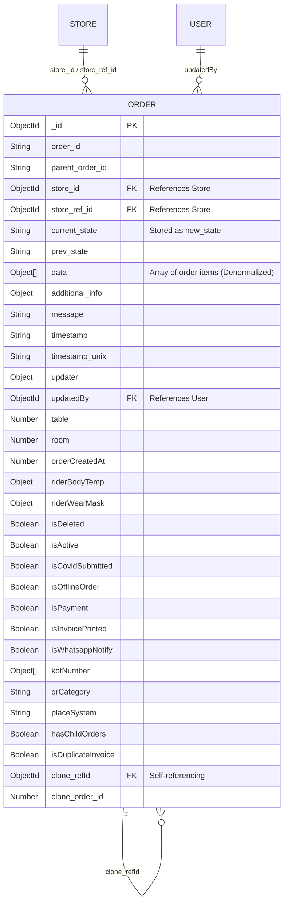
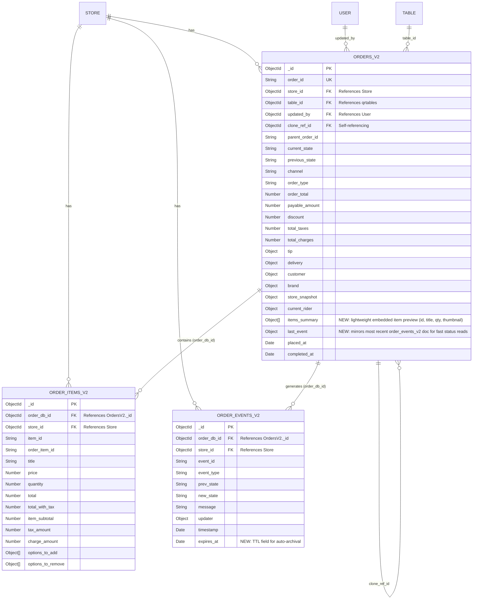

# Order System Schemas: V1 vs V2 Comparison (Optimized)

This document provides a comprehensive Entity-Relationship (ER) representation of the old (`Order`) and new (`orders_v2`, `order_items_v2`, `order_events_v2`) order schemas, along with **performance-optimized recommendations** for the V2 design. The core V2 structure and logic are preserved — the changes below are additive (indexes, embedded summaries, TTL) and do not alter existing relationships or fields.

---

## 1. Old Order Schema (V1)

The old schema utilized a single collection to store all order-related information, including metadata, state updates, and an array of items (`data`). This denormalized approach led to a bloated document size and difficulties in efficiently querying individual items or historical states.

### V1 ER Diagram

### Collection: `Order`

| Field | Type | Description / Key |
|-------|------|-------------------|
| `_id` | ObjectId | **PK** - Unique identifier for the order document |
| `order_id` | String | Public-facing order identifier |
| `store_id` / `store_ref_id` | ObjectId | **FK** -> `Store` collection |
| `updatedBy` | ObjectId | **FK** -> `User` collection |
| `clone_refId` | ObjectId | **FK** -> `Order` collection (Self-referencing clone) |
| `data` | Array of Objects | Denormalized array containing all order items |
| `new_state` | String | Current order status |
| `prev_state` | String | Previous order status |

---

## 2. New Order Schema (V2) — Optimized

The V2 schema keeps its normalized relational design across three collections, but applies MongoDB best practices to avoid unnecessary joins on hot read paths:

1. **`orders_v2`** — Core order metadata, pricing, customer info, current state, **plus an embedded `items_summary` array and `last_event` sub-document** (new).
2. **`order_items_v2`** — Full item detail, kept as its own collection for cross-order item analytics/search, but no longer duplicates `order_id` string (uses `order_db_id` only).
3. **`order_events_v2`** — Append-only lifecycle log, now with a **TTL/archival index** and a `last_event` mirror on the parent for fast status checks.

> **Why this doesn't break existing logic:** All original fields, relationships, and collections remain exactly as designed. The additions (`items_summary`, `last_event`) are **denormalized copies for read performance** — the source of truth is still `order_items_v2` and `order_events_v2`. Existing queries against those collections continue to work unchanged.

### V2 ER Diagram (Optimized)

### Collection: `orders_v2`

Core collection representing the order header.

| Field | Type | Description / Key |
|-------|------|-------------------|
| `_id` | ObjectId | **PK** - Unique identifier |
| `order_id` | String | **UK** - Unique public-facing order ID |
| `store_id` | ObjectId | **FK** -> `Store` collection |
| `table_id` | ObjectId | **FK** -> `qrtables` collection |
| `updated_by` | ObjectId | **FK** -> `User` collection |
| `clone_ref_id` | ObjectId | **FK** -> `orders_v2` collection |
| `current_state` | String | Current status of the order |
| `customer` / `delivery` | Sub-document | Embedded customer and delivery details |
| `order_total` / `payable_amount` | Number | Financial aggregates (excluding items) |
| `items_summary` **(new)** | Array of Objects | Lightweight preview `{item_id, title, quantity}` — avoids a `$lookup` to `order_items_v2` for list/dashboard views |
| `last_event` **(new)** | Sub-document | Mirrors the latest `order_events_v2` doc `{event_type, new_state, timestamp}` — avoids a query to `order_events_v2` for status checks |

### Collection: `order_items_v2`

Relational collection storing full individual line-item detail. Kept separate (not re-embedded) because it also serves cross-order analytics/search use cases; `orders_v2.items_summary` covers the common "view this order" path so this collection is only queried when full item detail is actually needed.

| Field | Type | Description / Key |
|-------|------|-------------------|
| `_id` | ObjectId | **PK** - Unique item document identifier |
| `order_db_id` | ObjectId | **FK** -> `orders_v2._id` (sole relational link — redundant `order_id` string removed) |
| `store_id` | ObjectId | **FK** -> `Store` collection |
| `item_id` | String | Reference to catalog item |
| `quantity` / `price` | Number | Item specifics |
| `total` / `total_with_tax` | Number | Computed item totals |

### Collection: `order_events_v2`

Event-sourcing collection for order lifecycle tracking. Full history stays here; `orders_v2.last_event` gives O(1) access to current status without touching this collection.

| Field | Type | Description / Key |
|-------|------|-------------------|
| `_id` | ObjectId | **PK** - Unique event document identifier |
| `order_db_id` | ObjectId | **FK** -> `orders_v2._id` (redundant `order_id` string removed) |
| `store_id` | ObjectId | **FK** -> `Store` collection |
| `event_type` | String | Type of lifecycle event |
| `prev_state` / `new_state` | String | State transition record |
| `timestamp` | Date | Exact time of the event transition |
| `expires_at` **(new)** | Date | TTL index field — auto-archives/purges old events after a defined retention window |

---

## 3. Recommended Indexes

| Collection | Index | Purpose |
|---|---|---|
| `orders_v2` | `{order_id: 1}` unique | Fast lookup by public order ID |
| `orders_v2` | `{store_id: 1, current_state: 1, placed_at: -1}` | Dashboard/list queries per store |
| `order_items_v2` | `{order_db_id: 1}` | Join/lookup from parent order |
| `order_items_v2` | `{store_id: 1, item_id: 1}` | Cross-order item analytics |
| `order_events_v2` | `{order_db_id: 1, timestamp: -1}` | Full event history for one order |
| `order_events_v2` | `{expires_at: 1}` TTL | Auto-archival of old events |

---

## 4. Write Consistency

Since order creation/updates now touch multiple collections (`orders_v2`, `order_items_v2`, `order_events_v2`), wrap these writes in a **MongoDB multi-document transaction** to guarantee an order is never left without its items or its initial event record. This is a process/implementation note — it does not change the schema shape.

---

## 5. Sharding Consideration (if scale requires it)

`store_id` is duplicated across all three collections intentionally — this supports using `{store_id: 1, order_id: 1}` (or `store_id` alone) as a shard key, keeping a store's orders, items, and events co-located and avoiding scatter-gather queries at scale.

---

## 6. Fields to Reconcile from V1

The following V1 fields do not have an obvious V2 equivalent and should be explicitly confirmed as intentionally deprecated, relocated into a sub-document (e.g., `delivery`, `brand`, `store_snapshot`), or pending migration:

`isCovidSubmitted`, `riderBodyTemp`, `riderWearMask`, `isWhatsappNotify`, `isOfflineOrder`, `isInvoicePrinted`, `kotNumber`, `qrCategory`, `placeSystem`, `isDuplicateInvoice`, `isDeleted`, `isActive`.

---

## 7. Schema Comparison Summary

| Feature | Old Schema (V1) | New Schema (V2 — Optimized) |
|---------|-----------------|-----------------|
| **Data Structure** | Monolithic / Denormalized | Relational / Normalized, with targeted denormalization for reads |
| **Item Storage** | Embedded array (`data: [Object]`) | Separate collection (`order_items_v2`) + lightweight `items_summary` embedded in `orders_v2` |
| **History Tracking** | Minimal (`prev_state`, `new_state`) | Full append-only log (`order_events_v2`) + `last_event` mirror on parent for fast status reads |
| **Relational Links** | N/A (embedded) | `order_db_id` (ObjectId) referencing parent order; redundant string `order_id` on children removed |
| **Discount/Tax Granularity** | Order-level only | Computed at both Item-level and Order-level |
| **Indexing** | Basic store/time indexes | Explicit compound indexes (`store_id` + `current_state` + `placed_at`) + TTL on events |
| **Schema Enforcement** | Loose (`Object` types) | Strict (explicitly defined sub-schemas) |
| **Write Consistency** | Single-document (atomic by default) | Multi-collection — requires transactions on create/update |
| **Read Performance** | Fast single-doc reads, slow item/history queries | Fast order+item-summary+status reads via embedded fields; full detail/history still queryable separately |